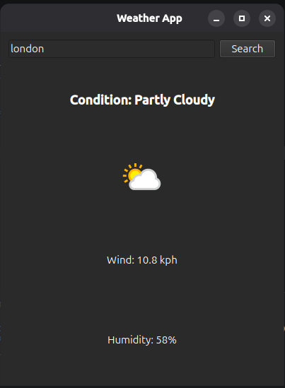
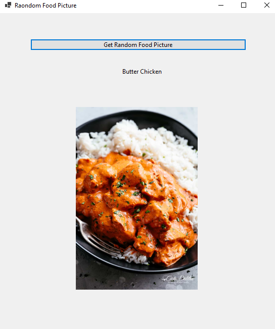

# API Practice Projects

In this session, we explored the basics of working with REST APIs and consuming web services in desktop applications.
Learning how to use Simple API

## Projects Implemented

### 1. Weather App (Python + PyQt6)
- Connected to the WeatherAPI service
- Retrieved weather information by city name
- Displayed weather condition, humidity, wind speed, and weather icons

### 2. Random Food App (Python + PyQt6)
- Connected to the Foodish API
- Retrieved random food images
- Displayed food images and food category names

### 3. Random Food App (C# WinForms)
- Consumed the same Foodish API using C#
- Parsed JSON responses
- Displayed food images in a PictureBox
- Extracted and displayed food category names

## Topics Covered

- HTTP requests
- REST APIs
- JSON responses
- Image downloading from URLs
- Working with external APIs in Python and C#
- GUI development with PyQt6 and WinForms

These mini-projects provided hands-on experience with API integration and desktop application development.