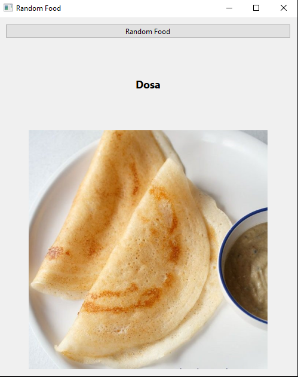

# Random Food App 🍔

A simple PyQt6 desktop application that displays random food images using the [Foodish API](https://foodish-api.com/).

Each time you click the button, a new food image is fetched and displayed along with its category name.

---

## Features

- Random food image generator
- Displays food category name (e.g., pizza, dosa, burger)
- Simple and clean PyQt6 interface
- Fast API-based image loading

---

## Project Structure

```text
random_food/
├── main.py
├── requirements.txt
├── service/
│   └── food_service.py
└── ui/
    └── food_ui.py
```

---

## Installation

```bash
pip install -r requirements.txt
```

---

## Run the App

```bash
python main.py
```

---

## How It Works

1. App calls Foodish API
2. Receives a random food image URL
3. Extracts food category from URL
4. Downloads image
5. Displays image + name in UI

---

## Screenshot



---

## Example Output

- Food: Pizza
- Food: Dosa
- Food: Burger

---

## Requirements

- Python 3.10+
- PyQt6
- requests

---

## API Used

- Foodish API  
  https://foodish-api.com/

---

## License

For educational purposes only.