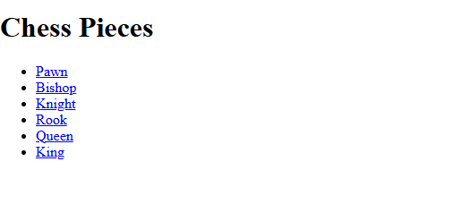
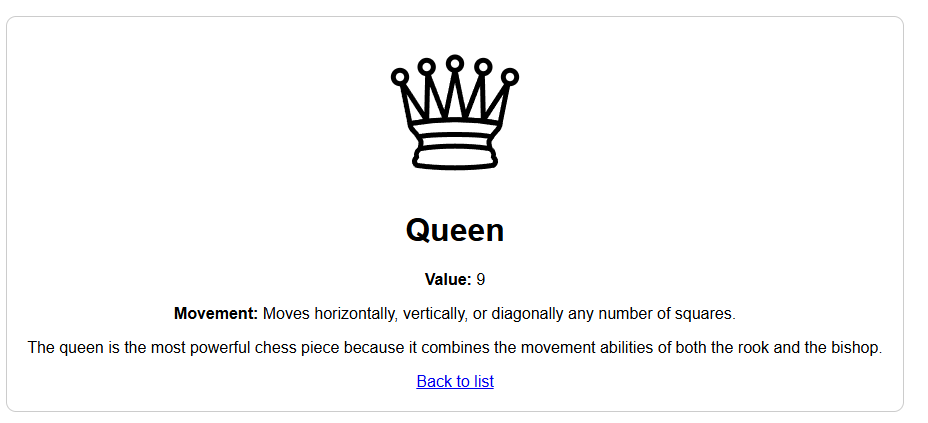

# Chess Info API & Web Interface ♟️

This is an educational project built with **FastAPI** to demonstrate how to combine a web server, template rendering with **Jinja2**, and a RESTful API. The project serves information about various chess pieces, providing both a user-friendly HTML interface and a structured JSON API.

##  Project Overview
The core purpose of this project is to learn how to:

- Set up a **FastAPI** application.
- Route requests to specific functions.
- Use **Jinja2** to dynamically render HTML templates.
- Handle data efficiently using dictionaries and JSON responses.

##  Project Previews

### 1. Main Dashboard (List of Pieces)
The landing page displays an overview of all chess pieces. Users can navigate to the specific details page for each piece.



### 2. Piece Detail View (Example: Queen)
Each piece has a dedicated page showcasing its value, movement rules, a brief description, and an illustration.



##  Prerequisites
To run this project, you will need Python installed on your system. It is recommended to use a virtual environment.

You will need the following dependencies:
- `fastapi`
- `uvicorn`
- `jinja2`

## Installation & Running the Project
Follow these steps to get the server running on your machine:

### 1. Clone the repository 

### 2. Install the dependencies
```
pip install -r reqirements.txt
```
# Run the development server

Use the following command to start the application with auto-reload enabled:

```bash
uvicorn main:app --reload
```

## Access the application
Open your web browser and navigate to:

[http://127.0.0.1:8000](http://127.0.0.1:8000)

 **API Endpoints**
This project provides both visual and data-centric access to the information:

| Endpoint | Method | Description |
| --- | --- | --- |
| `/` | **GET** | Renders the **HTML** index page listing all pieces. |
| `/pieces/{piece_name}` | **GET** | Renders the **HTML** detail page for a specific piece. |
| `/api/pieces/{piece_name}` | **GET** | Returns the raw data of a piece in **JSON** format. |

This project was created for educational purposes to explore the power of FastAPI.
