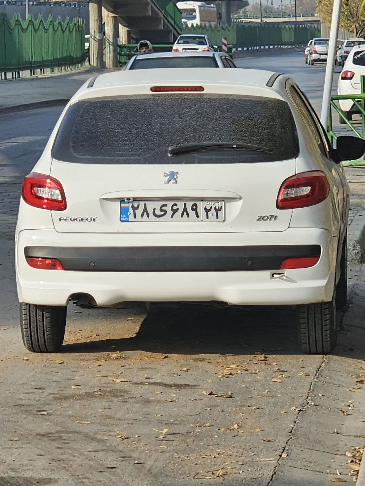
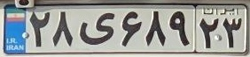

# Iranian License Plate Recognition API

A simple **computer vision API** built with **FastAPI** that detects Iranian vehicle license plates using **YOLO** and reads the plate number using **OCR**.

The API accepts a vehicle image, detects the license plate, extracts the plate region, and returns the recognized plate text.

---

# Project Overview

Pipeline used in this project:

```
Vehicle Image
      ↓
YOLO Plate Detection
      ↓
Plate Crop
      ↓
OCR Recognition
      ↓
License Plate Text
```

---

# Example

## Input Image

Place a sample vehicle image here.



---

## Detected Plate (Crop)

Optional visualization of the cropped plate.



---

## API Output

Example response returned by the API:

```json
{
  "filename": "car_a.jpg",
  "plate_text": [
    {
      "text": "۲۸ی۶۸۹۲۳",
      "score": null
    }
  ]
}
```

---

# Project Structure

```
plate-recognition-api/
│
├── main.py
├── model.py
├── best_plateDetection.pt
├── uploads/
│   ├── car_example.jpg
├── images/
│   └── plate_crop.jpg
└── README.md
```

---

# Dependencies

Install the required libraries before running the project.

```
pip install fastapi
pip install uvicorn
pip install ultralytics
pip install opencv-python
pip install hezar
pip install python-multipart
```

Or install them all together:

```
pip install fastapi uvicorn ultralytics opencv-python hezar python-multipart
```

---

# Running the API

Start the FastAPI server:

```
uvicorn main:app --reload
```

The API will run on:

```
http://127.0.0.1:8000
```

---

# API Documentation

FastAPI automatically generates documentation.

Swagger UI:

```
http://127.0.0.1:8000/docs
```

ReDoc:

```
http://127.0.0.1:8000/redoc
```

---

# API Endpoint

## Predict License Plate

**Endpoint**

```
POST /predict-plate
```

**Description**

Uploads a vehicle image and returns the detected Iranian license plate number.

**Request**

Upload an image file.

Field name:

```
file
```

**Example request using Swagger UI**

1. Open `/docs`
2. Select `/predict-plate`
3. Click **Try it out**
4. Upload an image
5. Click **Execute**

---

# Example Response

Successful prediction:

```json
{
  "filename": "car_a.jpg",
  "plate_text": [
    {
      "text": "۲۸ی۶۸۹۲۳",
      "score": null
    }
  ]
}
```

---

# Possible Errors

### Invalid File

```json
{
  "detail": "Uploaded file must be an image"
}
```

### No Plate Detected

```json
{
  "detail": "No license plate detected"
}
```

### Model Processing Error

```json
{
  "detail": "Model processing failed"
}
```

---

# Model Information

Plate Detection Model:

```
YOLO (Ultralytics)
best_plateDetection.pt
```

OCR Model:

```
hezarai/crnn-fa-license-plate-recognition-v2
```

---

# Educational Purpose

This project demonstrates:

- Building an **image-processing API with FastAPI**
- Using **YOLO for object detection**
- Applying **OCR for Persian license plate recognition**
- Handling **file uploads in FastAPI**
- Implementing **HTTPException for error handling**
- Automatically generated **API documentation with Swagger and ReDoc**
